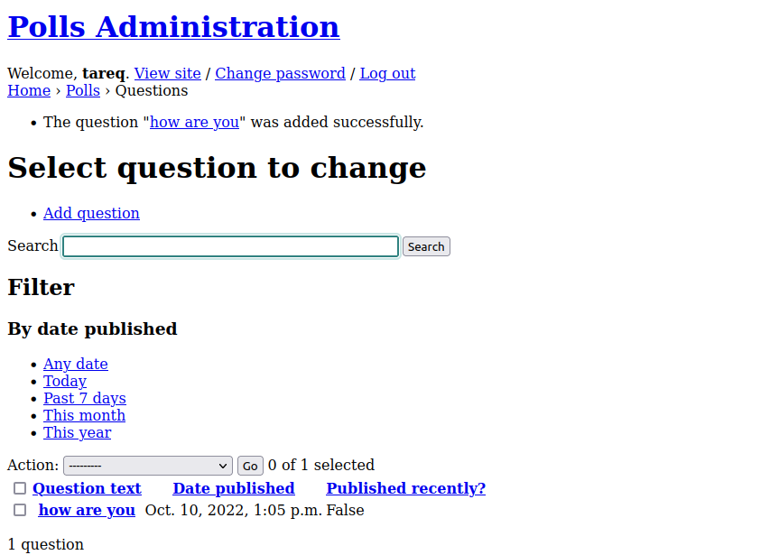
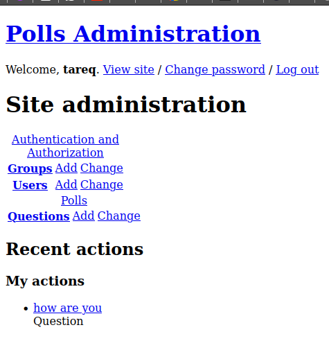

# Docker Task
## Requirments
- Create a dockerfile for postgres
- Create a dockerfile for the django application
- Connect the database and the django application
- Use Variables Instead of hardcoded (USERNAMES, PASSWORDS,.. Etc)

### Creating a Dockerfile for postgres:
- First we define the source image :
```
FROM postgres
```
- Then we provide the Env variables and arguments :
```
ARG POSTGRES_USER
ARG POSTGRES_PASSWORD
ARG POSTGRES_DB
ENV POSTGRES_DB=$POSTGRES_DB
ENV POSTGRES_USER=$POSTGRES_USER
ENV POSTGRES_PASSWORD=$POSTGRES_PASSWORD
```
- Docker file should look like this :
```
FROM postgres
ARG POSTGRES_USER
ARG POSTGRES_PASSWORD
ARG POSTGRES_DB
ENV POSTGRES_DB=$POSTGRES_DB
ENV POSTGRES_USER=$POSTGRES_USER
ENV POSTGRES_PASSWORD=$POSTGRES_PASSWORD

```
- Build image and tag it mypostgres and pass the ENV variables 

```
docker build --build-arg POSTGRES_USER=docker --build-arg POSTGRES_PASSWORD=Password --build-arg POSTGRES_DB=poll -t mypostgres .


```
- We create a network in order to have both of out containers on the same network so we can use host names: 
```
docker network create django-env

```
- We run the container and make sure to add it to the new network we created in the last step and we ADD a host name
```
docker run --network django-env -d -it -p 5432:5432 --hostname psgrs   --name psgrs mypostgres\
```

### Creating the django docker file:

- Clone the repo: 
```
mkdir polls-project
cd polls-project
git clone https://github.com/do-community/django-polls.github
```
- We create a file called requirements.txt in "polls-project/django-polls/" and we add :
```
boto3==1.9.252
botocore==1.12.252
Django==2.2.6
django-storages==1.7.2
docutils==0.15.2
gunicorn==19.9.0
jmespath==0.9.4
psycopg2==2.8.3
python-dateutil==2.8.0
pytz==2019.3
s3transfer==0.2.1
six==1.12.0
sqlparse==0.3.0
urllib3==1.25.6
```
- We add the enviroment VARS to the Database settings.pytz

- We start writing the docker file starting with the base image 

```
FROM python:3.7.4-alpine3.10
ADD django-polls/requirements.txt /app/requirements.txt

RUN set -ex \
    && apk add --no-cache --virtual .build-deps postgresql-dev build-base \
    && python -m venv /env \
    && /env/bin/pip install --upgrade pip \
    && /env/bin/pip install --no-cache-dir -r /app/requirements.txt \
    && runDeps="$(scanelf --needed --nobanner --recursive /env \
        | awk '{ gsub(/,/, "\nso:", $2); print "so:" $2 }' \
        | sort -u \
        | xargs -r apk info --installed \
        | sort -u)" \
    && apk add --virtual rundeps $runDeps \
    && apk del .build-deps

ADD django-polls /app
WORKDIR /app

ENV VIRTUAL_ENV /env
ENV PATH /env/bin:$PATH

EXPOSE 8000
CMD ["gunicorn", "--bind", ":8000", "--workers", "3", "mysite.wsgi:application"]

```
- Then we create a env file and add the following :
```
DJANGO_SECRET_KEY=Th!$!$@$3cr37K3y
DEBUG=True
DJANGO_ALLOWED_HOSTS=*
DATABASE_ENGINE=postgresql_psycopg2
DATABASE_NAME=poll
DATABASE_USERNAME=docker
DATABASE_PASSWORD=Password
DATABASE_HOST=psgrs ## choose the hostname that was provided to the postgres container when created
DATABASE_PORT=5432
DJANGO_LOGLEVEL=info

```
- We build the image
```
docker build -t django-polls:v0 .

```
- Then we start the migration making sure to add the network flag in order for django to communicate with the DB:
```
docker run --network django-env --env-file env django-polls:v0 sh -c "python manage.py makemigrations && python manage.py migrate"

```
- Then we Exec into the container to create a superuser
```
docker run --network django-env  -i -t --env-file env django-polls:v0 sh

```
```
python manage.py createsuperuser
```
- Finally we run the Container : 
```
 docker run --network django-env -d --env-file env -p 80:8000 django-polls:v0

```
## Results
### Create a postgres database in a container


### Create an image to house the django application





