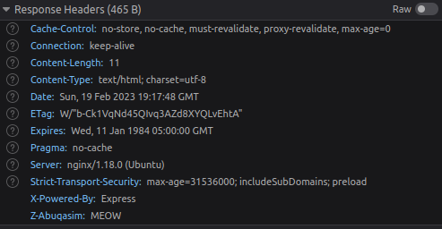
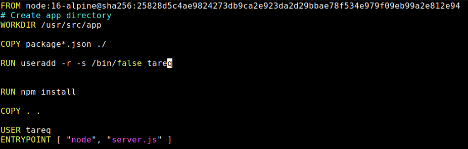
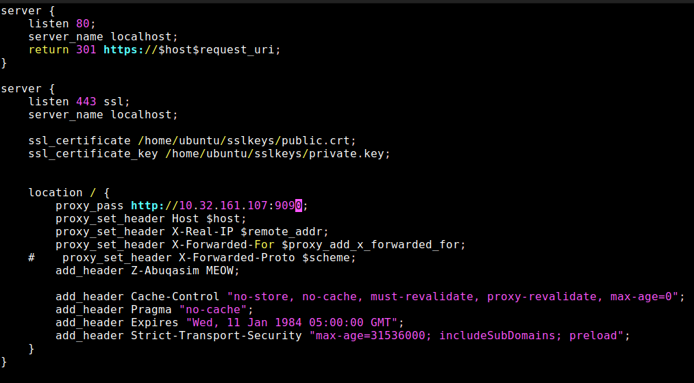

# Nginx Reverse proxy 

## Requirments
- build a docker image that has a nodeJs Helloworld website
- Allow only HTTPS
- Redirect http to HTTPS
- Disable cache
- Allow HTTPS-strict-protocol
------------------------------------------------------------------------------------------------------------------------------

## Preview:
- curl command showing all the headers mentiond No-cache https strict policy , and the custom added header Zabuqasim:meow


- Screenshot of the browser showing the headers



------------------------------------------------------------------------------------------------------------------------------

Here we have a Dockerfile that builds a simple "hello-world" node.js App. and the config for Nginx reverse proxy.
## Dockerfile
 
- Added the Sha256 to the image for extra security.
```yaml
FROM node:16-alpine@sha256:25828d5c4ae9824273db9ca2e923da2d29bbae78f534e979f09eb99a2e812e94
```
- Ran the adduser with the flags to give the user no privilages. so the container has no default root access.
```yaml
RUN useradd -r -s /bin/false tareq
```
------------------------------------------------------------------------------------------------------------------------------
## Nginx Reverse-Proxy
 
 - added redirection to HTTPS 
 ```yaml
server {
    listen 80;
    server_name localhost;
    return 301 https://$host$request_uri;
}

```
- Created self-signed ssl keys 
```yaml
server {
    listen 443 ssl;
    server_name localhost;

    ssl_certificate /home/ubuntu/sslkeys/public.crt;
    ssl_certificate_key /home/ubuntu/sslkeys/private.key;

```
- added the proxy headers

```yaml
 location / {
        proxy_pass http://10.32.161.107:9090;
        proxy_set_header Host $host;
        proxy_set_header X-Real-IP $remote_addr;
        proxy_set_header X-Forwarded-For $proxy_add_x_forwarded_for;
```
 - added a custom header
 ```yaml
        add_header Z-Abuqasim MEOW;
```
- added no-cache policy - to prevent the browser from caching
```yaml
add_header Cache-Control "no-store, no-cache, must-revalidate, proxy-revalidate, max-age=0";
        add_header Pragma "no-cache";
        add_header Expires "Wed, 11 Jan 1984 05:00:00 GMT";
```
- added https strict protocol to allow only https to the site
```yaml
        add_header Strict-Transport-Security "max-age=31536000; includeSubDomains; preload";
```
------------------------------------------------------------------------------------------------------------------------------
## Results

- Docker run Command with the host name ports and all 
 
 
- to show that the user running is not the root user.


- and finally gixy to check the configs and misconfigs

